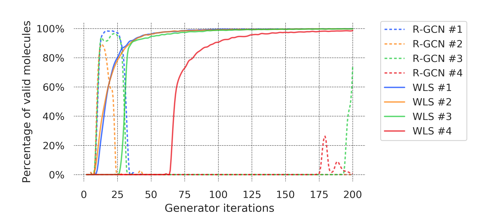

## What this is

This repository is the official implementation of "A Graph Similarity for Deep Learning," for the graph generation experiment.

Most of the code is from a PyTorch re-implementation of MolGAN from [MolGAN-pytorch](https://github.com/yongqyu/MolGAN-pytorch).

******
## Requirements:

The code uses QM9 dataset.

Run `./data/download_dataset.sh` to download the data,

then run `./data/sparse_molecular_dataset.py` to preprocess the data.

We run the experiments on the following python packages:
|Package name|Version|
|:---|:---|
|numpy|1.16.4|
|python|3.7.4|
|pytorch|1.3.1|
|rdkit|2019.09.3|
|scikit-learn|0.21.2|
|torchvision|0.4.2|

*****
## Training

To run with the original, R-GCN discriminator:
```
python main.py -disc default
```

To run with WLS-discriminator:
```
python main.py -disc WLS
```

The simplified results will be printed to the console,
and `log_losses.txt` will contain further details for evaluation.

## Evaluation

The training codes generate logs for evaluation. See the above.

******
## Pre-trained Models

All codes train the models from scratch.

******
## Results

### The percentage of valid molecules generated


