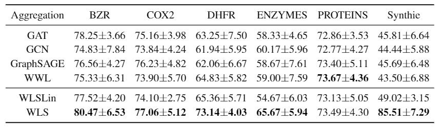
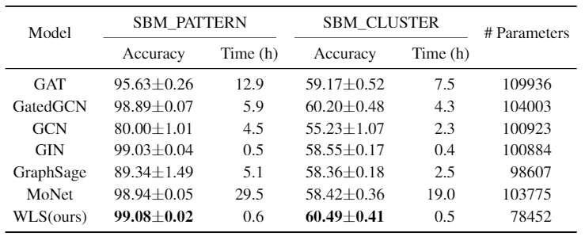
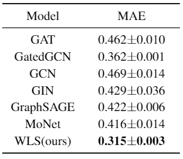

## What this is

This repository is the official implementation of "A Graph Similarity for Deep Learning."

Implementations for the baselines and data loading code is from [Benchmarking Graph Neural Networks](https://github.com/graphdeeplearning/benchmarking-gnns),

which is built on [Deep Graph Library](https://www.dgl.ai/) v0.4 and [PyTorch](https://pytorch.org/) v1.3.

******
## Installation

Follow the instructions of Benchmarking Graph Neural Networks:

[Installation](./docs/01_benchmark_installation.md) to install the benchmark and setup the environment.

[Download datasets](./docs/02_download_datasets.md) to download the benchmark datasets.

Or alternatively,
* TU Datasets shall be downloaded automatically.
* SBM datasets for node classification : [SBM_CLUSTER](https://www.dropbox.com/s/edpjywwexztxann/SBM_CLUSTER.pkl?dl=1), [SBM_PATTERN](https://www.dropbox.com/s/zf17n6x6s441s14/SBM_PATTERN.pkl?dl=1)
* ZINC dataset for graph regression : [ZINC](https://www.dropbox.com/s/bhimk9p1xst6dvo/ZINC.pkl?dl=1)

*****
## Training

### To run the **WLS kernel** experiment:
```sh
sh script_main_TUs_kernels.sh ${gpu_id} ${dataset}
```

For example, run
```
sh script_main_wls.sh 0 BZR
sh script_main_wls.sh 1 COX2
sh script_main_wls.sh 2 DHFR
sh script_main_wls.sh 3 ENZYMES
```
and the result is logged onto `log_TU_kernel.txt`.

### To run the **node classification** experiment:
```sh
sh script_main_SBMs_nns.sh ${gpu_id} ${random_seed}
```

For example, run
```
sh script_main_SBMs_nns.sh 0 1
sh script_main_SBMs_nns.sh 1 10
sh script_main_SBMs_nns.sh 2 100
sh script_main_SBMs_nns.sh 3 1000
```
which logs onto `log_sbms_nn.txt`.

### To run the **graph regression** experiment:
```sh
sh script_main_zinc_nns.sh ${gpu_id} ${random_seed}
```

For example, run
```
sh script_main_zinc_nns.sh 0 1
sh script_main_zinc_nns.sh 1 10
sh script_main_zinc_nns.sh 2 100
sh script_main_zinc_nns.sh 3 1000
```
which logs onto `log_zinc_nn.txt`.

### To run the **graph classification** by graph neural networks:
```sh
sh script_main_TUs_nns.sh ${gpu_id} ${random_seed}
```

For example, run
```
sh script_main_TUs_nns.sh 0 1
sh script_main_TUs_nns.sh 1 10
sh script_main_TUs_nns.sh 2 100
sh script_main_TUs_nns.sh 3 1000
```
which logs onto `log_TU_nn.txt`.

******
## Evaluation

The training codes generate logs for evaluation. See the above.

******
## Pre-trained Models

All codes train the models from scratch.

******
## Results

### Comparison of neighborhood aggregations


### Node classification on SBM datasets


### Graph regression on ZINC dataset


